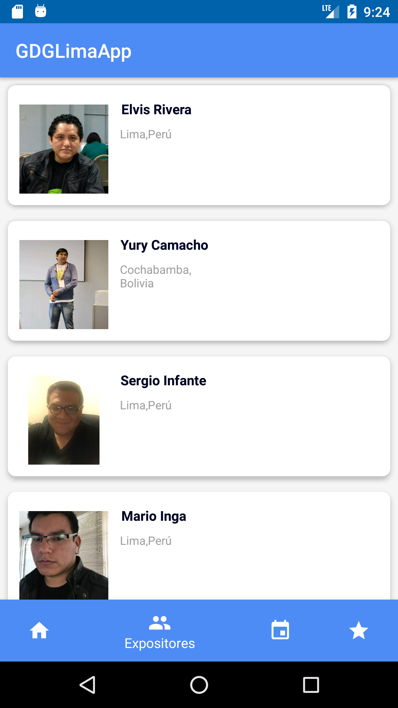

# GLab-Kotlin GDGLima 2017

GLab sobre Kotlin


## Resumen

Este codelab está enfocado al desarrollo de aplicaciones Android usando Kotlin. Iniciaremos con una introducción a este lenguaje , sus características, ventajas, interoperabilidad y diferencias con java. Luego, usaremos Android Studio para implementar  un ejemplo práctico de una aplicación Android desarrollada con Kotlin.

## [1] Bienvenido

Bienvenido al CodeLab de Kotlin , antes de empezar y para tener todo listo  para el CodeLab,  te recomiendo revisar lo siguiente :

### [1.1] Requisitos

 * IDE , vamos a usar Android Studio versión 2.3.3

 * Kotlin Plugin , vamos a usar un plugin para poder construir un proyecto en Kotlin en  Android Studio. La versión que usaremos será v1.1.4-Release-studio2.3-3

 * Descargar los files del CodeLab , para esto seleccionas CLONE OR DOWNLOAD /DOWNLOAD ZIP o desde el siguiente link
 ```
  https://github.com/GDGLima/GLab-Kotlin/archive/master.zip
 ```
 

 * Explorar el CodeLab , en los files del CodeLab vamos a encontrar lo siguiente :

  * La carpeta  "/KotlinTemplate"
  * La carpeta  "/GDGLimaApp"
  * La carpeta "/images"
  * Los archivos "README.md" y "TipsAndTricks.md"


 * Proyecto Template , en los archivos de este codelab se encuentra un  proyecto base  llamado "KotlinTemplate" . Para poder abrirlo desde Android Studio seleccionas FILE / OPEN / KotlinTemplate . Al abrirlo la primera vez te va pedir descargar dependencias , para esto debes estar conectado a internet.

 

  * Ejecutar el ejemplo , antes de correr nuestra app vamos a necesitar un emulador. En este [link](https://developer.android.com/studio/run/emulator.html) puedes encontrar información de como crear y configurar un emulador , también si deseas pueden usar [Genymotion](https://www.genymotion.com/) . Finalmente para ejecutar el proyecto seleccionamos :

  ```
      Run / Run App
  ```
    

### [1.2] Aprende sobre Kotlin

  * Kotlin es bastante amplio y trae consigo conceptos nuevos, por lo que sería genial que vayas leyendo un poco sobre este lenguaje de programación. Para esto te recomiendo visitar la pagina oficial, donde encontrarás todo lo que necesitas y más, de hecho tiene muy buena documentación.

  ```
     https://kotlinlang.org/docs/reference/
  ```
  * Aprendamos sobre este lenguaje de programación, hagamos un review de Kotlin [ReviewKotlin](./ReviewKotlin.md)

## [2] Instala Android Studio

  * Trabajaremos con la versión 2.3.3 de Android Studio que pueden descargar desde aquí https://developer.android.com/studio/index.html . Esta versión requiere de un plugin para poder usar Kotlin.
  * La versión 3.0+ de Android Studio ya soporta Kotlin pero aún esta en beta. Pueden encontrar más información en el siguiente link https://developer.android.com/studio/preview/index.html

## [3] Crea tu primer proyecto y configura el plugin de Kotlin

#### [3.1] Crea un nuevo proyecto con Android Studio

  * Paso 1 : Start a new Android Studio project

  * Paso 2 : Configure you new project
    * Application name : KotlinTemplate
    * Company domain : emedinaa.com
    * Package name : com.gdglima.glabkotlin.kotlintemplate
    * Project location : ..GLabKotlin/repo/KotlinTemplate

  * Paso 3 : Minimum SDK

    * API 15 - Android 4.0.3

  * Paso 4 : Add an Activity

    * Empty Activity

  * Paso 5 : Customize de Activity

    

    

    


#### [3.2] Instala el plugin de Kotlin para Android Studio

  * Android Studio / Preferences / Plugins / Browse repositories / Kotlin / install
  * La versión del plugin que vamos a utilizar es v1.1.4-Release-studio2.3-3
  * Reiniciar Android Studio

  

#### [3.3] Configura el proyecto para trabajar con Kotlin

  * Tools / Kotlin / Configure project in Kotlin
  * Configuration / Android with Gradle
  * Configure Kotlin with Android with Gradle / All Modules / version 1.1.4-3
  * Se cambia la configuración de nuestro proyecto y debemos sincronizar (Gradle)

  

  

#### [3.4] Revisa los cambios realizados en el proyecto

  * En el <b>build.gradle</b> del proyecto vemos los siguientes cambios :
  ```groovy
    buildscript {

      ext.kotlin_version = '1.1.4-3'

      repositories {
          jcenter()
      }
      dependencies {
          classpath 'com.android.tools.build:gradle:2.3.3'
          classpath "org.jetbrains.kotlin:kotlin-gradle-plugin:$kotlin_version"

      }

  ```

  * y en el <b>build.gradle</b> de la App (app/build.gradle)
  ```groovy
    apply plugin: 'kotlin-android'
    ...

    dependencies {
        compile fileTree(dir: 'libs', include: ['*.jar'])
        androidTestCompile('com.android.support.test.espresso:espresso-core:2.2.2', {
            exclude group: 'com.android.support', module: 'support-annotations'
        })
        compile 'com.android.support:appcompat-v7:26.+'
        compile 'com.android.support.constraint:constraint-layout:1.0.2'
        testCompile 'junit:junit:4.12'
        compile "org.jetbrains.kotlin:kotlin-stdlib-jre7:$kotlin_version"
    }

  ```

#### [3.5] Agrega Kotlin Android Extensions

* Kotlin nos da herramientas para agilizar el desarrollo en Android , este conjunto de utilizarios se encuentran en el plugin llamado "Kotlin Android Extensiones"

* En el build.gradle de la app agregamos
```
  apply plugin: 'com.android.application'
  apply plugin: 'kotlin-android'
  apply plugin: 'kotlin-android-extensions'
```

* Si deseas conocer más sobre Kotlin Android Extensions , revisa este [link](https://kotlinlang.org/docs/tutorials/android-plugin.html)

#### [3.6] Conoce algunos tips y trucos

* El plugin de Kotlin en Android Studio integra una serie de herramientas para facilitar el desarrollo de Android en este IDE , por lo que recopilé algunos tips y trucos que te pueden servir [TipsAndTricks](./TipsAndTricks.md)

## [4] GDGLima App

* Vamos a construir una pequeña aplicación en Kotlin para eventos del GDGLima , donde mostraremos las siguientes secciones :

  * Inicio

  * Expositores

  * Agenda

  * Sponsors


   


 

## [5] Construye las vistas y la UI de tu App

* findViewById

```
      findViewById(R.id.imageViewJava).setOnClickListener(...);
      findViewById(R.id.imageViewKotlin).setOnClickListener(...);
```

```
      imageViewJava.setOnClickListener{ ... }
```


* Fragments en Java

```java
public class SpeakersFragment extends Fragment {

  private static final String ARG_PARAM1 = "param1";
  private static final String ARG_PARAM2 = "param2";

  private String mParam1;
  private String mParam2;

  public SpeakersFragment() {}

  public static SpeakersFragment newInstance(String param1, String param2) {
        SpeakersFragment fragment = new SpeakersFragment();
        Bundle args = new Bundle();
        args.putString(ARG_PARAM1, param1);
        args.putString(ARG_PARAM2, param2);
        fragment.setArguments(args);
        return fragment;
  }

  @Override
  public void onCreate(Bundle savedInstanceState) {
      super.onCreate(savedInstanceState);
      if (getArguments() != null) {
          mParam1 = getArguments().getString(ARG_PARAM1);
          mParam2 = getArguments().getString(ARG_PARAM2);
      }
  }

  @Override
  public View onCreateView(LayoutInflater inflater, ViewGroup container,
                            Bundle savedInstanceState) {
       // Inflate the layout for this fragment
       return inflater.inflate(R.layout.fragment_speakers, container, false);
  }

  @Override
  public void onActivityCreated(@Nullable Bundle savedInstanceState) {
       super.onActivityCreated(savedInstanceState);
  }
}
```

* Fragments en Kotlin

```java
class SpeakersFragmentK : Fragment {

  companion object {
    private val ARG_PARAM1 = "param1"
    private val ARG_PARAM2 = "param2"

    fun newInstance(param1: String, param2: String): SpeakersFragmentK {
        var args: Bundle = Bundle()
        args.putString(ARG_PARAM1, param1)
        args.putString(ARG_PARAM2, param2)

        var homeFragment: SpeakersFragmentK = newInstance()
        homeFragment.arguments = args
        return homeFragment
    }

    fun newInstance(): SpeakersFragmentK {
        return SpeakersFragmentK()
    }
  }

  override fun onCreate(savedInstanceState: Bundle?) {
     super.onCreate(savedInstanceState)
     if (arguments != null) {
         mParam1 = arguments.getString(ARG_PARAM1)
         mParam2 = arguments.getString(ARG_PARAM2)
     }
  }

  override fun onCreateView(inflater: LayoutInflater?, container: ViewGroup?, savedInstanceState: Bundle?): View? {
    return inflater!!.inflate(R.layout.fragment_speakers, container, false)
  }

  override fun onActivityCreated(savedInstanceState: Bundle?) {
    super.onActivityCreated(savedInstanceState)
  }

}

```


## [6] Agrega interactividad  a tu app mediante eventos

```
    private void  goToActivity(Class activity){
        startActivity(new Intent(this,activity));
    }

    @Override
    public void onClick(View view) {
          switch (view.getId()){
              case R.id.imageViewJava:
                      goToActivity(JavaActivity.class);
                  break;
              case R.id.imageViewKotlin:
                      goToActivity(KotlinActivity.class);
                  break;
          }
    }
    private void app() {
        findViewById(R.id.imageViewJava).setOnClickListener(this);
        findViewById(R.id.imageViewKotlin).setOnClickListener(this);

    }
```


```

   private fun  showMessage(){
        Toast.makeText(this,"Hello Kotlin",Toast.LENGTH_LONG).show()
   }

   private fun app() {
        supportActionBar?.setDisplayHomeAsUpEnabled(true)
        //textViewHello
        imageViewJava.setOnClickListener{
            showMessage();
        }
    }
```

## [7] Maneja Listas y Adaptaders usando RecyclerView

  * Crear un adapter en Kotlin

  ```java
    class EventAdapterK(val events:List<EntityK.EventK>, val context: Context): RecyclerView.Adapter<EventAdapterK.ViewHolder>() {

      class ViewHolder(view: View) : RecyclerView.ViewHolder(view) {
          val textViewName: TextView = view.textViewName
          val textViewDesc: TextView = view.textViewDesc
          val imageView: ImageView = view.imageView
      }

      override fun onCreateViewHolder(parent: ViewGroup, viewType: Int): ViewHolder {
          val layoutInflater = LayoutInflater.from(parent.context)
          return ViewHolder(layoutInflater.inflate(R.layout.row_event, parent, false))
      }

      override fun onBindViewHolder(holder: ViewHolder, position: Int) {
          val time: String = events[position].time!!
          val activity: String? = events[position].activity

          holder.textViewName.text = time
          holder.textViewDesc.text = activity
      }

      override fun getItemCount(): Int {
          return events.size
      }
  }
  ```

  * RecyclerView

  ```java
      private fun ui(){
         val mLayoutManager: RecyclerView.LayoutManager = LinearLayoutManager(activity!!)
         recyclerViewSpeakers.layoutManager= mLayoutManager
     }

     private fun renderSpeakers(speakers:List<EntityK.SpeakerK>){
       if(activity!=null){
           speakerAdapter= SpeakerAdapterK(speakers,activity)
           recyclerViewSpeakers.setAdapter(speakerAdapter)
       }
    }

  ```

## [8] Carga datos dinámicamente y aprende sobre persistencia de datos.

  * Vamos a consumir servicios Restful para cada de las secciones de la app , para esto usaremos  Retrofit2 [http://square.github.io/retrofit/](http://square.github.io/retrofit/) . Esta librería esta hecha en Java , lo cual no es un problema , ya que Kotlin  es interoperable con Java, asi que puedes seguir usando las librerias que hayas trabajado anteriormente sin problemas.

  * Route & Endpoints

    * Route
      ```
        https://blooming-oasis-63723.herokuapp.com/
      ```

    * Endpoints

Acción | Tipo  | URL
------------ | ------------- | -------------      
Listar Expositores  | GET | /gdglima/speakers
Listar Sponsors  | GET | /gdglima/sponsors
Listar ponencias  | GET | /gdglima/ponencias

  * Pueden usar una herramienta como POSTMAN para probar los servicios [link](https://www.getpostman.com/)

  * ApliClient , en esta clase vamos a declarar el  cliente HTPP y los endpoints

  ```java
    class ApliClientK {
      companion object {
          private var servicesApiInterface: ServicesApiInterface? = null
          private val API_BASE_URL = "https://blooming-oasis-63723.herokuapp.com"

          private fun interceptor(): HttpLoggingInterceptor {
              val httpLoggingInterceptor: HttpLoggingInterceptor = HttpLoggingInterceptor()
              httpLoggingInterceptor.setLevel(HttpLoggingInterceptor.Level.BODY)
              return httpLoggingInterceptor
          }

          private fun defaultCache():Cache{
              val cacheSize:Long=10 * 1024 * 1024;
              val cacheDir = File(System.getProperty("java.io.tmpdir"), UUID.randomUUID().toString())
              val cache:Cache= Cache(cacheDir,cacheSize)
              return  cache
          }

          fun getMyApiClient(): ServicesApiInterface {
              var builder: Retrofit.Builder = Retrofit.Builder()
                      .baseUrl(API_BASE_URL)
                      .addConverterFactory(GsonConverterFactory.create())

              var httpClient: OkHttpClient.Builder = OkHttpClient.Builder()
              httpClient.addInterceptor(interceptor())
              httpClient.cache(defaultCache())

              var retrofit: Retrofit = builder.client(httpClient.build()).build()
              servicesApiInterface = retrofit.create(
                      ServicesApiInterface::class.java)

              return servicesApiInterface as ServicesApiInterface
          }
      }

      interface ServicesApiInterface{

             @Headers("Content-Type: application/json")
             @GET("/gdglima/speakers")
             fun speakers():Call<SpeakerResponseK>

             @Headers("Content-Type: application/json")
             @GET("/gdglima/sponsors")
             fun sponsors():Call<SponsorResponseK>

             @Headers("Content-Type: application/json")
             @GET("/gdglima/ponencias")
             fun ponencias():Call<EventResponseK>
         }
  }
  ```

  * Realicemos una llamada a un servicio

  ```java
      private val callback: Callback<SpeakerResponseK> = object: Callback<SpeakerResponseK> {
        override fun onResponse(call: Call<SpeakerResponseK>?, response: Response<SpeakerResponseK>?) {
            log({"onResponse $response.body()"})
            renderSpeakers(response!!.body().data)
        }

        override fun onFailure(call: Call<SpeakerResponseK>?, t: Throwable?) {
            log({"onFailure $t"})
        }
      }

      private fun requestSpeakers(){
          ApliClientK.getMyApiClient().speakers()
          //val call: Call<SpeakerResponseK> = ApliClientK.getMyApiClient().speakers()
          currentCall = ApliClientK.getMyApiClient().speakers()
          currentCall!!.enqueue(callback)
      }
  ```

## [9] Referencias

  * Google CodeLabs Kotlin https://codelabs.developers.google.com/codelabs/build-your-first-android-app-kotlin/
  * Android Studio https://developer.android.com/studio/index.html

  * Realm - Getting started with Kotlin and Anko on Android
  https://academy.realm.io/posts/getting-started-with-kotlin-and-anko/

## [10] Ayuda a mejorar este CodeLab

  * Si encuentras algún issue puedes reportarlo a este link [https://github.com/GDGLima/GLab-Kotlin/issues](https://github.com/GDGLima/GLab-Kotlin/issues)
  * Si deseas colaborar puedes clonar este repo y luego enviar un pull request

  Happy coding !
